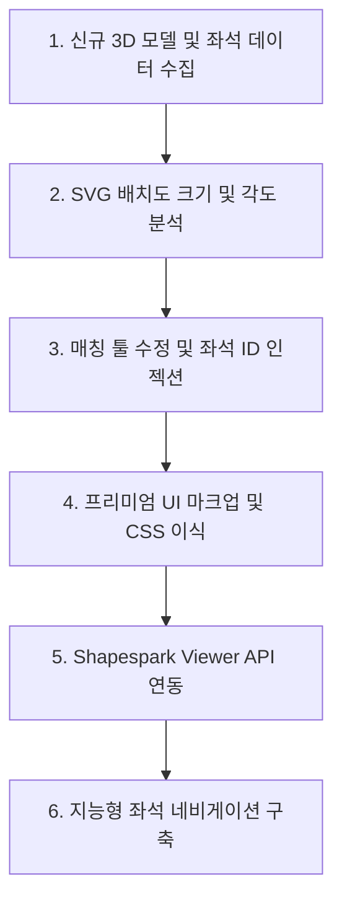

# 🚀 Shapespark 3D 좌석 시야 연동 서비스 이식 가이드 (Porting Guide)

이 문서는 다른 3D 모델(Shapespark 소스)과 신규 좌석배치도(SVG)를 활용하여 본 프로젝트와 동일한 **"3D 가상 시야 + 2D 좌석배치도 연동 아키텍처"**를 가장 빠르고 정확하게 복제 및 구축하기 위한 기술 이식 설명서입니다.

---

## 📋 전체 구축 프로세스 요약



---

## 🛠️ 1단계: 신규 소스 및 데이터 준비 (Prerequisites)

새로운 프로젝트를 구성하기 위해 아래 3가지 파일이 필요합니다.

1. **Shapespark 3D 데이터 폴더**: Shapespark 웹 에디터에서 빌드(Bundle)한 결과물 디렉터리 (예: `2026-05-22-19-41-08/`).
2. **신규 좌석배치도 파일**: ID가 부여되지 않은 순수 디자인 상태의 SVG 포맷 좌석배치도 (예: `seatmap_kor.svg`).
3. **JS 좌석 맵 메타데이터**: 각 좌석의 식별자(View_ID), 층(Floor), 구역(Zone), 행(Row), 열(Seat) 및 해당 위치의 3D 카메라 View 이름이 매핑된 JS 파일 (예: `gs_arts_center_seatmap.js`).

---

## 📐 2단계: 신규 SVG 데이터 분석 및 패턴 분류

새로운 SVG 파일에서 좌석을 구성하는 사각형(`<rect>`) 요소들의 기하학적 특성을 먼저 파악해야 합니다.

1. **좌석 크기(크기 사양) 확인**:
   - SVG 텍스트 파일을 열고 좌석 사각형의 `width`와 `height` 값을 파악합니다. (예: 가로 13px, 세로 15px)
2. **`analyze_svg_zones.py` 파일의 타겟 설정 수정**:
   ```python
   # analyze_svg_zones.py 내 경로 및 크기 설정 수정
   JS_PATH   = r"c:\WORK\[새_프로젝트_폴더]\[새_좌석맵].js"
   SVG_PATH  = r"c:\WORK\[새_프로젝트_폴더]\[새_좌석배치도].svg"
   
   # rects.append 조건 부분에서 새로 파악한 w, h 범위 설정
   if 5 <= w <= 50 and 5 <= h <= 50:
       rects.append((x, y))
   ```
3. **스크립트 실행 및 결과 해석**:
   - 터미널에서 이 분석 스크립트를 실행하여 좌석의 회전(Rotation) 각도 그룹과 X, Y 좌표 범위를 출력합니다.
   - 예: 좌측 구역은 `rotate(7)`, 중앙은 `rotate(0)`, 우측은 `rotate(-7)` 등 특수한 회전 값을 식별해 둡니다.

---

## ⚡ 3단계: 자동 매핑 실행 및 좌석 ID 인젝션

`gs_arts_center_seatmap.js`에 JSON 형식으로 저장된 좌석 정보(`View_ID`, `Seat_Type` 등)를 바탕으로 각 SVG 요소에 고유 ID를 바인딩합니다.

1. **매칭 도구 파일 수정 (`fill_svg_ids.py` 또는 `fill_svg_ids.html` 내 정규식)**:
   - 새로 파악한 `<rect>`의 고유 정규식 패턴을 대입합니다.
   ```javascript
   // fill_svg_ids.html 33번 라인 부근의 정규식을 새 SVG 규격에 맞춥니다.
   const rectRegex = /<rect\s+(id="([^"]*?)"\s+)?x="([^"]*?)"\s+y="([^"]*?)"\s+width="[새가로]"\s+height="[새세로]".../g;
   ```
2. **구역 정렬 매핑 규칙 수정**:
   - 회전 각도에 매핑되는 실제 구역 알파벳(또는 이름)을 정해 줍니다.
   - 예: `rotation 7` -> A구역, `rotation 0` -> B구역, `rotation -7` -> C구역
3. **인젝터 도구 실행**:
   - **GUI 방식**: `fill_svg_ids.html`을 브라우저에 띄우고 **[Run Processing]** 버튼을 누르면 누락된 좌석 ID가 순차 주입된 새로운 SVG 파일 다운로드 링크가 나타납니다.
   - **CLI 방식**: `python fill_svg_ids.py`를 실행하여 직접 파일에 ID(`View_1F_A_1` 등)를 주입합니다.

---

## 🎨 4단계: 프리미엄 UI 및 마이크로 인터렉션 스타일 이식

신규 템플릿 프로젝트의 CSS(`gs_arts_center_ui.css`)에 프리미엄 가독성과 부드러운 마이크로 인터렉션을 보장하는 스타일을 이식합니다.

### ① 와이드 뷰 좌석 팝업 레이아웃
좌석 배치도를 답답하지 않게 조작할 수 있도록 화면 대비 **가로 90%, 세로 88%** 수준의 넓은 뷰를 제공합니다.
```css
.seatmap-popup {
    background-color: #ffffff;
    width: 90%;
    max-width: 1800px;
    height: 88%;
    max-height: 1200px;
    border-radius: 4px 4px 0 0;
    box-shadow: 0 -20px 40px rgba(0, 0, 0, 0.4);
}
```

### ② 큐빅 베지어 기반 마이크로 플로팅 인터렉션
층/구역 선택 버튼 클릭 및 호버 시 감각적으로 반응하도록 **0.3s cubic-bezier(0.4, 0, 0.2, 1)** 트랜지션과 **translateY** 플로팅 효과를 이식합니다.
```css
.floor-btn, .section-btn {
    transition: all 0.3s cubic-bezier(0.4, 0, 0.2, 1);
}
.floor-btn:hover, .section-btn:hover {
    color: rgba(0, 0, 0, 0.65);
    transform: translateY(-3px);
}
.floor-btn:active, .section-btn:active {
    transform: translateY(-1px);
}
```

### ③ 조작 안내 매뉴얼 팝업 (Manual Overlay)
감각적인 반투명 레이아웃과 함께, 딤드를 제거해 시각적 피로감을 줄이고 닫기 버튼을 상단에 정밀 배치합니다.
```css
.manual-ui-card {
    border: 0;
    position: absolute;
    top: 100px; right: 80px; bottom: 100px; left: 80px;
    background: transparent;
    padding: 40px;
}
.manual-ui-inner {
    position: relative;
    width: 98%;
}
#btn_help_hide {
    position: absolute;
    top: 28px;
    right: 28px;
    background: transparent;
    border: 0;
    cursor: pointer;
    z-index: 10;
    transition: transform 0.2s ease;
}
#btn_help_hide:hover {
    transform: scale(1.1);
}
```

---

## 🔗 5단계: Shapespark Viewer API 연동

최종적으로 좌석 클릭 시 3D 카메라 뷰를 작동시키는 코드를 완성합니다.

### ① Shapespark Viewer API 스크립트 로드
```html
<!-- index.html 내 Shapespark API 로드 -->
<script src="[Shapespark_폴더]/bundle.js"></script>
```

### ② 뷰어 초기화 및 카메라 연동 자바스크립트 구현
```javascript
let viewer = null;

// Shapespark 뷰어 초기화
function initViewer() {
    const iframe = document.getElementById('shapespark-iframe');
    viewer = new WALK.Viewer(iframe);
}

// 특정 좌석 클릭 시 호출될 카메라 전환 함수
function zoomToSeat(viewId) {
    if (!viewer) return;
    
    // JS 데이터에서 viewId에 매칭되는 3D 카메라 View 이름을 가져옵니다.
    const seatInfo = GS_ARTS_CENTER_SEAT_MAP_DATA.find(s => s.View_ID === viewId);
    
    if (seatInfo && seatInfo.View_Name) {
         viewer.switchToView(seatInfo.View_Name, 1.5); // 1.5초 동안 부드럽게 이동
    }
}
```

---

## 🧭 6단계: 지능형 좌석 네비게이션 및 예외 처리 시스템 이식

사용자가 무대 시야를 좌석 단위로 앞/뒤로 간편하게 넘겨볼 수 있도록 화살표 버튼 연동 및 예외 처리 로직을 구현합니다.

### ① "none" 타입 더미 좌석 자동 건너뛰기
배치도 구조상 존재하는 휠체어석 보조 공간이나 가상 더미 좌석 등 예매 불가능한 `"none"` 타입의 좌석은 자동으로 건너뛰어 관객의 사용자 경험을 해치지 않도록 합니다.

### ② 연속 전환 튐 방지 인터락 (isNavigating Lock)
3D 카메라가 전환되는 도중에 사용자가 화살표 버튼을 연속해서 빠르게 클릭할 경우 생기는 API 오버헤드와 화면 렌더링 오작동을 차단하기 위해, **1초의 타임아웃 락**을 필수로 적용해야 합니다.

```javascript
let isNavigating = false;

// 이전 좌석 네비게이션 예시
document.getElementById('btn_prev_seat').addEventListener('click', () => {
  if (isNavigating || !currentSeatViewId) return;
  const index = GS_ARTS_CENTER_SEAT_MAP_DATA.findIndex(s => s.View_ID === currentSeatViewId);

  let prevIndex = index - 1;
  // 좌석 타입이 "none"인 경우 계속 건너뜀
  while (prevIndex >= 0 && GS_ARTS_CENTER_SEAT_MAP_DATA[prevIndex].Seat_Type === "none") {
    prevIndex--;
  }

  if (prevIndex >= 0) {
    isNavigating = true; // 이동 락 발동
    showViewId(GS_ARTS_CENTER_SEAT_MAP_DATA[prevIndex].View_ID);
    setTimeout(() => { isNavigating = false; }, 1000); // 1초 후 해제
  }
});
```
