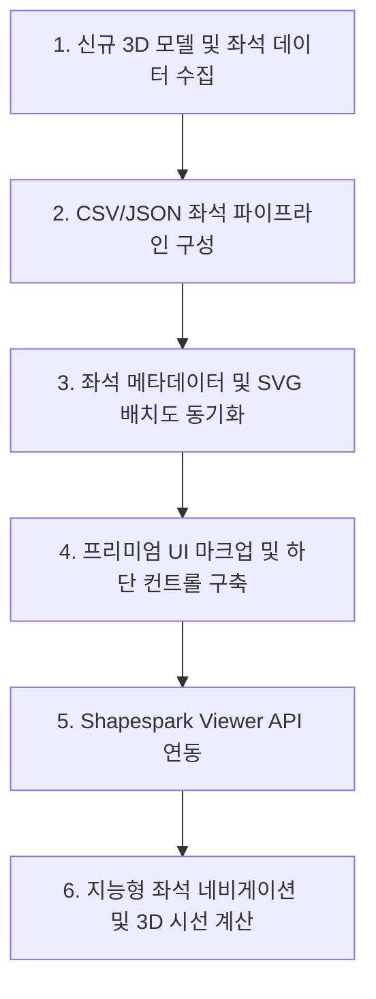

# 🚀 Shapespark 3D 좌석 시야 연동 서비스 이식 가이드 (Porting Guide)

이 문서는 다른 3D 모델(Shapespark 소스)과 신규 좌석배치도를 활용하여 본 프로젝트와 동일한 **"3D 가상 시야 + 2D 좌석배치도 연동 아키텍처"**를 빠르고 정확하게 복제 및 구축하기 위한 기술 이식 설명서입니다.

---

## 📋 전체 구축 프로세스 요약


```mermaid
graph TD
    A[1. 신규 3D 모델 및 좌석 데이터 수집] --> B[2. CSV/JSON 좌석 파이프라인 구성]
    B --> C[3. 좌석 메타데이터 및 SVG 배치도 동기화]
    C --> D[4. 프리미엄 UI 마크업 및 하단 컨트롤 구축]
    D --> E[5. Shapespark Viewer API 연동]
    E --> F[6. 지능형 좌석 네비게이션 및 3D 시선 계산]
```

---

## 🛠️ 1단계: 신규 소스 및 데이터 준비 (Prerequisites)

새로운 프로젝트를 구성하기 위해 아래 파일들이 필요합니다.

1. **Shapespark 3D 데이터 폴더**: Shapespark 웹 에디터에서 빌드(Bundle)한 결과물 디렉터리 (예: `2026-06-10-13-06-28/`).
2. **신규 좌석배치도 데이터**: 좌석 ID와 위치 정보가 포함된 SVG / HTML 배치도.
3. **CSV 좌석 원본 메타데이터 (`gs_arts_center_seatmap.csv`)**: 층(Floor), 구역(Zone), 행(Row), 열(Seat), 3D 관람 시야 View ID 매핑 파일.
4. **데이터 자동 변환 스크립트 (`convert_csv_json.py`)**: CSV 원본을 JSON 및 JS 메타데이터 객체로 자동 변환하는 파이썬 스크립트.

---

## 📐 2단계: CSV ↔ JSON 좌석 데이터 파이프라인 관리

프로젝트의 좌석 데이터는 CSV로 관리되며, 파이썬 스크립트를 통해 웹 애플리케이션용 JSON/JS로 동기화합니다.

1. **`gs_arts_center_seatmap.csv` 편집**:
   - `Floor`, `Zone`, `Row`, `Seat`, `View_ID`, `Seat_Type` 항목을 규격에 맞게 작성합니다.
2. **변환 스크립트 실행 (`convert_csv_json.py`)**:
   ```bash
   python convert_csv_json.py
   ```
   - 스크립트가 실행되면 `gs_arts_center_seatmap.json`과 `gs_arts_center_seatmap.js`가 자동으로 갱신됩니다.
3. **JS 데이터 구조 확인**:
   ```javascript
   // gs_arts_center_seatmap.js 로드 시 글로벌 변수 제공
   window.GS_ARTS_CENTER_SEAT_MAP_DATA = [
       { "Floor": "1F", "Zone": "A", "Row": "1", "Seat": "1", "View_ID": "1F_A_1_1", "Seat_Type": "standard" },
       ...
   ];
   ```

---

## ⚡ 3단계: 2D 좌석 배치도 및 SVG 요소 ID 바인딩

배치도의 각 좌석 바인딩 요소(SVG `<rect>` 또는 HTML DOM)에 CSV의 `View_ID`와 일치하는 식별자를 부여합니다.

1. **좌석 DOM `id` 규격 설정**:
   - 예: `1층 A구역 1행 1열` ➡️ `id="View_1F_A_1_1"` 또는 `data-view-id="1F_A_1_1"`
2. **이벤트 바인딩 구조**:
   - 배치도 클릭 시 클릭한 요소의 `View_ID`를 추출하여 Shapespark 3D 카메라 이동 함수로 전달합니다.

---

## 🎨 4단계: 프리미엄 UI 마크업 및 버튼별 기능 명세

신규 프로젝트의 CSS(`gs_arts_center_ui.css`)에 프리미엄 가독성과 부드러운 마이크로 인터랙션을 보장하는 스타일을 이식합니다.

### ① 와이드 뷰 좌석 팝업 레이아웃
```css
.seatmap-popup {
    background-color: #ffffff;
    width: 90%;
    max-width: 1800px;
    height: 88%;
    max-height: 1200px;
    border-radius: 4px 4px 0 0;
    box-shadow: 0 -20px 40px rgba(0, 0, 0, 0.4);
}
```

### ② 큐빅 베지어 기반 마이크로 플로팅 인터랙션
```css
.floor-btn, .section-btn {
    transition: all 0.3s cubic-bezier(0.4, 0, 0.2, 1);
}
.floor-btn:hover, .section-btn:hover {
    color: rgba(0, 0, 0, 0.65);
    transform: translateY(-3px);
}
.floor-btn:active, .section-btn:active {
    transform: translateY(-1px);
}
```

### ③ 하단 컨트롤 UI (`nav-control`) 버튼별 상세 기능 및 JS 구현 명세

하단 컨트롤 영역(`index.html` 570~585 라인)은 3D 뷰어 화면 좌측 하단에 위치하며, 좌석 순회, 배치도 팝업 토글, 무대 장치 상태 조절 기능을 담당합니다.

```html
<div class="custom-ui-bottom-left">
  <!-- 1. 좌석 순회 및 배치도 토글 그룹 -->
  <div class="nav-control">
    <button id="btn_prev_seat" class="nav-arrow" aria-label="Previous Seat"></button>
    <button id="btn_seatmap" class="nav-text">
      <span id="btn_seatmap_select_title">좌석선택</span>
      <span id="btn_seatmap_floor"></span><span id="btn_seatmap_text"></span>
    </button>
    <button id="btn_next_seat" class="nav-arrow" aria-label="Next Seat"></button>
  </div>
  
  <!-- 2. 무대 및 시선 제어 그룹 -->
  <div class="nav-control">
    <button id="btn_stage_change" class="nav-text" onclick="btn_stage_change()">무대변경</button>
    <button id="btn_op_change" class="nav-text" onclick="btn_op_change()">OP석 변경</button>
    <button id="btn_stage_look" class="nav-text" onclick="btn_stage_look()">무대 바라보기</button>
  </div>
</div>
```

#### 📊 버튼별 개요 표 (Overview Table)

| 버튼 ID | 표시 텍스트 | 연동 JS 함수 / 이벤트 | 기능 및 구현 요약 |
| :--- | :--- | :--- | :--- |
| **`btn_prev_seat`** | `◀` (이전 좌석) | `click` 이벤트 리스너 | 현재 선택 좌석의 이전 순번 좌석으로 이동 (`Seat_Type: "none"` 건너뛰기 & 1.2초 락 적용) |
| **`btn_seatmap`** | **좌석선택** / 선택 좌석 | `click` 이벤트 리스너 & `reset_btn_seatmap()` | 2D 좌석배치도 팝업(`seatmap-overlay`) 토글 및 선택 좌석 정보(`1층 A구역 1행 1열`) 동적 렌더링 |
| **`btn_next_seat`** | `▶` (다음 좌석) | `click` 이벤트 리스너 | 현재 선택 좌석의 다음 순번 좌석으로 이동 |
| **`btn_stage_change`** | **무대변경** | `btn_stage_change()` | 무대 커튼 3D 노드들(`curtain_1~3`)의 표시/숨김(`hide/show`) 단계별 토글 및 2초 알림 팝업 표출 |
| **`btn_op_change`** | **OP석 변경** | `btn_op_change()` | 오케스트라 피트 노드들(`op_chair`, `op_wall`, `op_floor`)의 가시성 토글 및 2초 알림 표출 |
| **`btn_stage_look`** | **무대 바라보기** | `btn_stage_look()` | 현재 카메라 위치 유지 + 삼각함수(`Math.atan2`) 기반 무대 중심(`vec_LookAt`) 시선(Yaw/Pitch) 고정 연산 |

---

#### 💻 버튼별 상세 JavaScript 구현 예시

##### 1) 이전 / 다음 좌석 버튼 (`btn_prev_seat`, `btn_next_seat`)
```javascript
// 이전 좌석 이동 (btn_prev_seat)
document.getElementById('btn_prev_seat').addEventListener('click', () => {
  if (isNavigating || !currentSeatViewId) return;
  const index = GS_ARTS_CENTER_SEAT_MAP_DATA.findIndex(s => s.View_ID === currentSeatViewId);

  let prevIndex = index - 1;
  // Seat_Type이 "none"인 더미/빈 공간 좌석은 자동으로 건너뜀
  while (prevIndex >= 0 && GS_ARTS_CENTER_SEAT_MAP_DATA[prevIndex].Seat_Type === "none") {
    prevIndex--;
  }

  if (prevIndex >= 0) {
    isNavigating = true; // 연속 이동 타임아웃 락 발동
    showViewId(GS_ARTS_CENTER_SEAT_MAP_DATA[prevIndex].View_ID);
    setTimeout(() => { isNavigating = false; }, 1200);
  }
});
```

##### 2) 좌석선택 토글 버튼 (`btn_seatmap` & `reset_btn_seatmap`)
```javascript
// 배치도 팝업 토글 및 좌석 선택 상태 업데이트
const btnSeatmap = document.getElementById('btn_seatmap');
btnSeatmap.addEventListener('click', () => {
  const overlay = document.getElementById('seatmap-overlay');
  overlay.style.display = (overlay.style.display === 'flex') ? 'none' : 'flex';
});

// 좌석 선택 리셋 및 UI 초기화 함수
function reset_btn_seatmap() {
  document.getElementById('btn_seatmap_floor').innerText = '';
  document.getElementById('btn_seatmap_text').innerText = '';
  document.getElementById('btn_seatmap_select_title').style.display = 'block';
  document.getElementById('btn_seatmap').classList.remove('has-selection');
}
```

##### 3) 무대 변경 버튼 (`btn_stage_change`)
```javascript
var stage_change_step = 0;
const nodeNames1 = ['curtian_3'];
const nodeNames2 = ['curtain_2'];
const nodeNames3 = ['curtain_1'];
const nodeNames  = ['curtain_1', 'curtain_2', 'curtian_3'];

function btn_stage_change() {
  // 단계별 커튼 노드 hide / show 제어
  if (stage_change_step == 0) {
    nodeNames1.forEach(name => { for (const node of viewer.findNodesOfType(name)) node.hide(); });
    stage_change_step = 1;
  } else if (stage_change_step == 1) {
    nodeNames2.forEach(name => { for (const node of viewer.findNodesOfType(name)) node.hide(); });
    stage_change_step = 2;
  } else if (stage_change_step == 2) {
    nodeNames3.forEach(name => { for (const node of viewer.findNodesOfType(name)) node.hide(); });
    stage_change_step = 3;
  } else if (stage_change_step == 3) {
    nodeNames.forEach(name => { for (const node of viewer.findNodesOfType(name)) node.show(); });
    stage_change_step = 0;
  }

  viewer.requestFrame(); // 3D 씬 화면 갱신

  // 2초간 무대장치 변경 상태 토스트 메시지 표시
  const btnStage = document.getElementById('btn_stage_change');
  if (btnStage) {
    btnStage.setAttribute('data-msg', '무대장치' + stage_change_step);
    btnStage.classList.add('show-msg');
    setTimeout(() => { btnStage.classList.remove('show-msg'); }, 2000);
  }
}
```

##### 4) OP석 변경 버튼 (`btn_op_change`)
```javascript
var op_change_step = 0;
const nodeOPNames1 = ['op_chair'];
const nodeOPNames2 = ['op_wall'];
const nodeOPNames3 = ['op_floor'];
const nodeOPNames  = ['op_floor', 'op_wall', 'op_chair'];

function btn_op_change() {
  // 전체 OP 노드 초기화 숨김
  nodeOPNames.forEach(name => { for (const node of viewer.findNodesOfType(name)) node.hide(); });

  // 단계별 OP석 노드 노출
  if (op_change_step == 0) {
    nodeOPNames1.forEach(name => { for (const node of viewer.findNodesOfType(name)) node.show(); });
    op_change_step = 1;
  } else if (op_change_step == 1) {
    nodeOPNames2.forEach(name => { for (const node of viewer.findNodesOfType(name)) node.show(); });
    op_change_step = 2;
  } else if (op_change_step == 2) {
    nodeOPNames3.forEach(name => { for (const node of viewer.findNodesOfType(name)) node.show(); });
    op_change_step = 3;
  } else if (op_change_step == 3) {
    op_change_step = 0;
  }

  viewer.requestFrame();

  const btnOP = document.getElementById('btn_op_change');
  if (btnOP) {
    btnOP.setAttribute('data-msg', 'OP좌석' + op_change_step);
    btnOP.classList.add('show-msg');
    setTimeout(() => { btnOP.classList.remove('show-msg'); }, 2000);
  }
}
```

##### 5) 무대 바라보기 버튼 (`btn_stage_look`)
```javascript
function btn_stage_look() {
  if (isNavigating) return;

  const view = new WALK.View();
  view.position = viewer.getCameraPosition(); // 현재 카메라 좌표 유지

  // 상대 거리벡터 계산
  var dx = vec_LookAt.x - view.position.x;
  var dy = vec_LookAt.y - view.position.y;
  var dz = vec_LookAt.z - view.position.z;
  var horizontalDistance = Math.sqrt(dx * dx + dy * dy);

  // 무대 중심점(vec_LookAt) 방향 시선각(Yaw/Pitch) 연산
  view.rotation.yaw = Math.atan2(dy, dx);
  view.rotation.pitch = Math.atan2(dz, horizontalDistance);

  isNavigating = true;
  viewer.switchToView(view);
  setTimeout(() => { isNavigating = false; }, 1200);
}
```

---

## 🔗 5단계: Shapespark Viewer API 연동

Shapespark API를 통해 3D 뷰어 인스턴스를 가져오고 씬 로딩 완료 및 카메라 이동을 제어합니다.

### ① Shapespark Viewer API 스크립트 로드
```html
<!-- index.html -->
<script type="module">
  WALK.ASSETS_URL = '2026-06-10-13-06-28/';
</script>
<script src="2026-06-10-13-06-28/webwalk/walk.min.js"></script>
<script src="gs_arts_center_seatmap.js"></script>
<script src="gs_arts_center_ui.js"></script>
```

### ② 뷰어 인스턴스 획득 및 이벤트 연결
```javascript
// Shapespark 뷰어 인스턴스 획득 (WALK.getViewer 사용)
var viewer = WALK.getViewer();

// 3D 씬 로딩 준비 완료 이벤트 바인딩 (초기 UI 로드 함수 연동)
viewer.onSceneReadyToDisplay(initUIOnSceneReady);

function initUIOnSceneReady() {
    // 로딩 배너 페이드 아웃 및 메인 UI/서비스 선택 오버레이 표출
    const banner = document.getElementById('start-banner');
    const selectOverlay = document.getElementById('service-select-overlay');
    if (banner) banner.style.opacity = '0';
    if (selectOverlay) selectOverlay.style.display = 'flex';
}
```

---

## 🧭 6단계: 무대 시선(Yaw/Pitch) 연산 및 지능형 좌석 네비게이션

### ① 무대 중앙 지점 고정 시선(Yaw / Pitch) 동적 연산
좌석 위치(`view.position`)에서 무대 중심 타겟 좌표(`vec_LookAt`)를 항상 부드럽게 주시하도록 `yaw`와 `pitch`를 수치 계산합니다.

```javascript
function focusCameraToStage(view, vec_LookAt) {
    // 1. 타겟 무대 중심 좌표와의 X, Y, Z 거리차 계산
    var dx = vec_LookAt.x - view.position.x;
    var dy = vec_LookAt.y - view.position.y;
    var dz = vec_LookAt.z - view.position.z;

    // 2. 수평 거리(바닥면) 계산
    var horizontalDistance = Math.sqrt(dx * dx + dy * dy);

    // 3. 삼각함수를 이용한 Yaw 및 Pitch 값 동적 계산
    view.rotation.yaw = Math.atan2(dy, dx);
    view.rotation.pitch = Math.atan2(dz, horizontalDistance);

    // 4. 연산된 카메라 뷰로 부드럽게 전환
    viewer.switchToView(view);
}
```

### ② 연속 전환 튐 방지 인터락 (isNavigating Lock)
3D 카메라가 전환되는 동안 사용자가 빠르게 클릭 시 발생하는 API 오버헤드를 막기 위해 락(Lock)을 적용합니다.

```javascript
let isNavigating = false;

function navigateToSeat(viewId) {
    if (isNavigating || !viewId) return;

    const seatInfo = GS_ARTS_CENTER_SEAT_MAP_DATA.find(s => s.View_ID === viewId);
    if (!seatInfo || seatInfo.Seat_Type === "none") return; // 더미/빈 좌석 건너뛰기

    isNavigating = true; // 이동 락 발동
    
    const view = viewer.findView(seatInfo.View_ID);
    if (view) {
        focusCameraToStage(view, { x: 0, y: 15, z: 2 }); // 무대 중앙 좌표 예시
    }

    setTimeout(() => { 
        isNavigating = false; // 1.2초 후 락 해제
    }, 1200);
}
```
